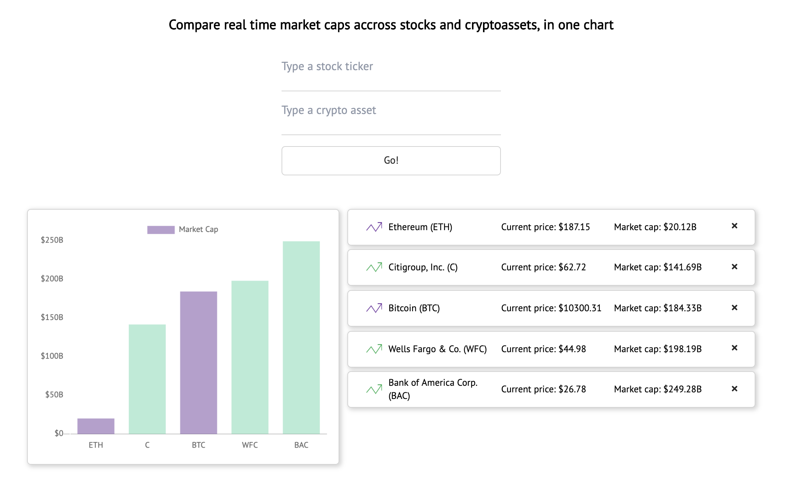
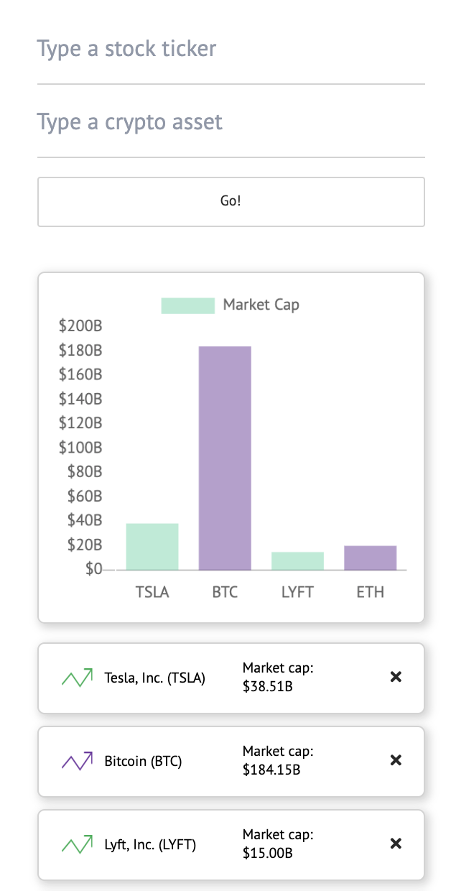

# Asset Compare

A delightful app where users can check and compare real time market caps/prices of stocks and crypto assets, on one chart.

## Motivation

Cryptoassets are an emerging market class. As market cap is typically a good indicator of overall "network value", we hope to surprise users with how valuable some of these crypto-networks (such as bitcoin) are becomming, compared to some perceived "too big to fail" comanpies. One of the easiest ways to illustrate that, is a bar chart.

## Link: 

- [Asset Compare](https://jongrinnellsf.github.io/api/)

## Screenshots
Desktop View:

Mobile View:

## Built With

### Front-End
* jQuery
* JavaScript
* ChartJS
* HTML/CSS
* Messari Crypto API (crypto data)
* IEX Cloud API (stocks/company data)

## Features

* Add and compare stock/cryptoasset by ticker/symbol (e.g. AAPL, BTC, ETH, F)
* Remove assets from the list 
* Gather real time price/market cap information 
* Add up to 2 assets per search 